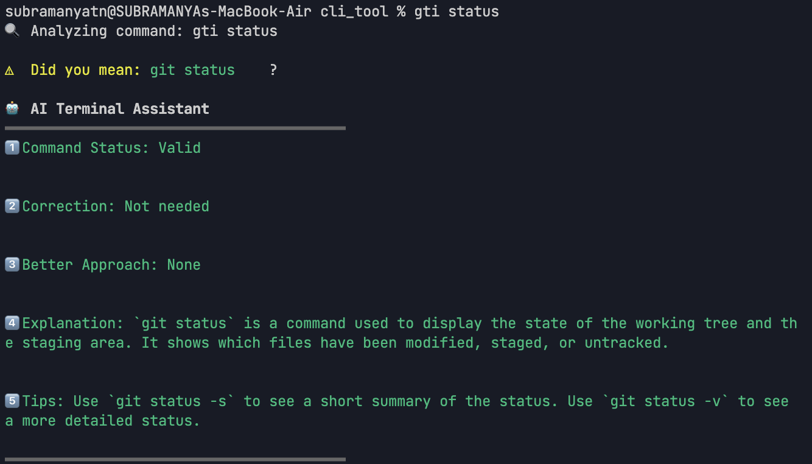
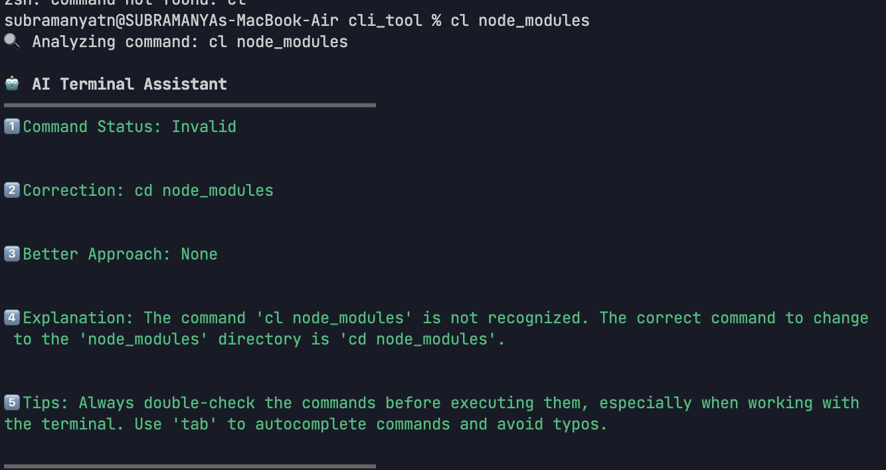
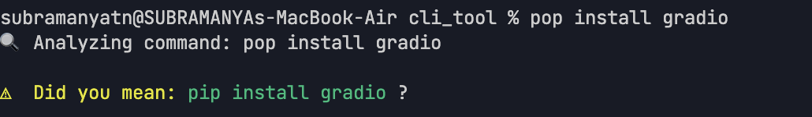
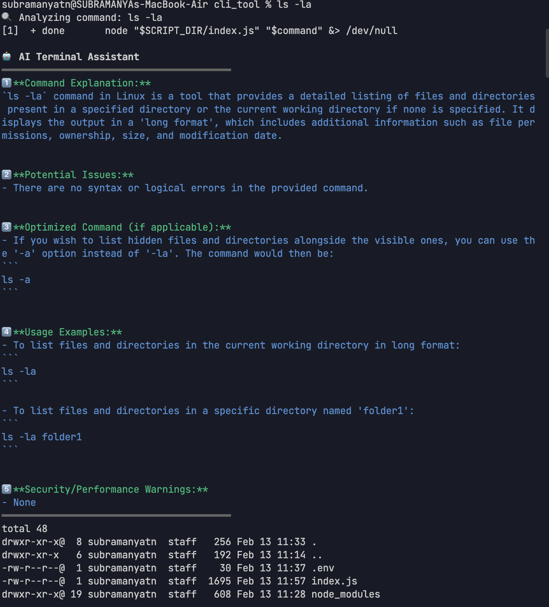
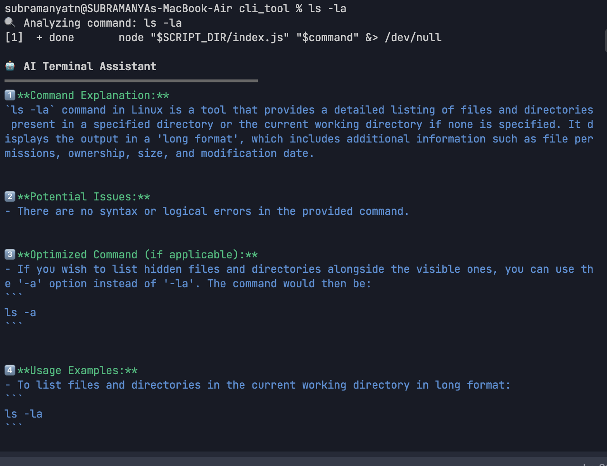

# AI Terminal Assistant 🤖

An intelligent CLI tool that analyzes your shell commands in real-time using Google's Gemini AI, providing suggestions, corrections, and best practices.

## ✨ Features

- 🔍 **Command Analysis**
  - Real-time command validation
  - Syntax error detection
  - Typo correction (e.g., `gti status` → `git status`)

- 🚀 **Smart Suggestions**
  - Command optimization tips
  - Better alternatives
  - Performance improvements

- 🛡️ **Security Checks**
  - Dangerous command warnings
  - Permission-related advice
  - Security best practices

- 📚 **Learning Tools**
  - Command explanations
  - Usage examples
  - Common pitfalls

## 🚀 Quick Start

### 1. Prerequisites

- Python 3.11+
- Node.js 16+
- Google Gemini API key

### 2. Backend Setup

```bash
# Clone and navigate to the project
git clone https://github.com/your-repo/ai-terminal-assistant.git
cd ai-terminal-assistant

# Create and activate virtual environment
python -m venv venv
source venv/bin/activate

# Install dependencies
cd backend
pip install -r requirements.txt

# Set up Gemini API key
export GEMINI_API_KEY="your_api_key_here"

# Start the backend server
python -m uvicorn main:app --reload
```

### 3. CLI Tool Setup

```bash
# In a new terminal
cd cli_tool
npm install

# Activate the AI assistant
source shell_hook.sh
```

## 💡 Usage Examples
ex1:

ex2:

ex3:

ex4:

ex5:

### 1. **Command Correction**
```bash
# Typo in command
$ gti status
🤖 Suggestion: Did you mean 'git status'?

# Missing space
$ cd..
🤖 Suggestion: Did you mean 'cd ..'?
```

### 2. **Security Warnings**
```bash
$ rm -rf *
⚠️ Warning: Dangerous command detected!
🔒 Tip: Use 'rm -ri' for safer, interactive deletion
```

### 3. **Command Optimization**
```bash
$ cat file.txt | grep "pattern"
💡 Better approach: grep "pattern" file.txt
```

### 4. **Best Practices**
```bash
$ chmod 777 file.txt
⚠️ Security risk: Using 777 permissions
🛡️ Consider: chmod 644 for files, 755 for directories
```

## 🔧 Configuration

The assistant can be customized through:
- Backend settings in `.env`
- CLI preferences in `config.js`
- Shell hook options in `shell_hook.sh`

## 🚑 Troubleshooting

### 1. **Backend Issues**
```bash
# Check if backend is running
curl http://localhost:8000/health

# Restart backend
python -m uvicorn main:app --reload
```

### 2. **CLI Issues**
```bash
# Reload shell hook
source shell_hook.sh

# Debug mode
DEBUG=true source shell_hook.sh
```

## 🔒 Security Note

- Commands are analyzed locally before execution
- No sensitive data is sent to external services
- API calls are made only to Google's Gemini API
- Add space before commands to skip analysis

## 📝 License

MIT License - Feel free to use and modify!

